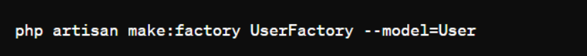

# Seminário de `Laravel`

# Seção 1: Introdução ao Laravel

- Laravel é um framework PHP livre e open-source criado por Taylor B. Otwell para o desenvolvimento de sistemas web que utilizam o padrão MVC.
- Taylor B. Otwell era um grande fã do `CodeIgniter`, um popular framework PHP da época que sofria com problemas de manutenção por ter sido abandonado pela empresa responsável
- Com isso, ele aproveitou a oportunidade para criar um framework mais moderno que teria as características do `CodeIgniter`. Sendo assim, em 2011 ele criou o `Laravel`.
- O `Laravel` foi reescrito em 2013, utilizando componentes de outro framework PHP, o `Symfony`.

## 1.1 O que é Laravel?

- O `Laravel` é um framework de aplicação PHP que oferece uma abordagem para o desenvolvimento de aplicações web, seguindo o padrão arquitetônico MVC (Model-View-Controller).
- No contexto do `Laravel`, o padrão MVC é implementado de forma robusta e eficiente.
- Model:
    - Os modelos em Laravel representam a camada de acesso aos dados. Eles são responsáveis pela interação com o banco de dados, realizando operações como consultas, inserções, atualizações e exclusões.
    - Cada modelo geralmente corresponde a uma tabela do banco de dados, e os modelos são usados para recuperar e armazenar informações no banco de dados.
    - Os modelos no Laravel geralmente são armazenados no diretório app/Models.
- View:
    - As visualizações em Laravel são responsáveis por exibir os dados aos usuários. Elas geralmente consistem em arquivos de template que combinam HTML com tags Blade (o mecanismo de template do Laravel) para renderizar dados dinâmicos.
    - As visualizações podem ser retornadas pelos controladores para serem exibidas aos usuários ou podem ser incluídas em outras visualizações para reutilização.
    - As visualizações no Laravel geralmente são armazenadas no diretório resources/views.
- Controller:
    - Os controladores em Laravel gerenciam o fluxo de solicitações HTTP. Eles atuam como intermediários entre as rotas e os modelos, processando as solicitações do usuário e fornecendo as respostas adequadas.
    - Os controladores são responsáveis por recuperar dados dos modelos, interagir com os serviços necessários, preparar dados para exibição e retornar as visualizações ou respostas apropriadas para o navegador.
    - Os controladores no Laravel geralmente são armazenados no diretório app/Http/Controllers.
- Além desses três componentes principais, o Laravel também usa outros conceitos para tornar a arquitetura mais flexível e poderosa, como:
    - Routes: As rotas definem como as solicitações HTTP devem ser manipuladas. Elas mapeiam URLs para controladores e métodos de controladores específicos.
    - Middleware: O middleware é uma camada intermediária entre a solicitação HTTP e o aplicativo. Ele pode ser usado para realizar tarefas como autenticação, autorização, manipulação de solicitações e muito mais.
    - Services: Os serviços são classes que encapsulam a lógica de negócios reutilizável e são frequentemente utilizados para manter os controladores finos e concentrados na manipulação das solicitações HTTP.
    - Validação: O Laravel fornece um sistema de validação poderoso que pode ser usado para validar dados de entrada do usuário antes de serem processados pelo aplicativo.

## 1.2 Por que Laravel?

- O Laravel é frequentemente elogiado por sua capacidade de ser adotado incrementalmente, o que significa que você pode começar a usar partes específicas do framework em seu projeto sem ter que adotar o framework inteiro de uma só vez.
- Isso oferece flexibilidade e permite que os desenvolvedores escolham as partes do Laravel que melhor se encaixam em suas necessidades, sem a sobrecarga de aprender e implementar todo o framework de uma vez só.
- Benefícios da adoção incremental:
    - Flexibilidade na adoção: Você pode começar usando apenas os componentes do Laravel que são relevantes para seu projeto. 
    - Escalabilidade: À medida que seu projeto cresce, você pode adicionar mais recursos e componentes do Laravel conforme necessário, sem ter que redesenhar todo o projeto. Isso torna mais fácil escalar seu aplicativo à medida que sua base de código cresce.
    - Curva de aprendizado gradual: Os desenvolvedores podem aprender e dominar um componente do Laravel de cada vez, em vez de se sentirem sobrecarregados com o aprendizado de todo o framework de uma vez.
- Malefícios da adoção incremental:
    - Complexidade adicional: Adotar apenas partes do Laravel pode adicionar complexidade ao seu projeto, especialmente se você estiver misturando vários frameworks ou bibliotecas. Isso pode dificultar a manutenção e o entendimento do código para outros membros da equipe.
    - Integração com outros componentes: Se você estiver integrando apenas partes do Laravel em uma aplicação existente, pode haver desafios na integração com outros componentes ou bibliotecas de terceiros, especialmente se eles não estiverem alinhados com a arquitetura do Laravel.
    - Dependências: Ao adotar partes do Laravel, você estará adicionando dependências ao seu projeto, o que pode aumentar a complexidade do gerenciamento de dependências e das atualizações futuras.
- Alguns motivos para a escolha do Laravel são:
    - Facilidade de Integração:
        - Laravel foi projetado com uma arquitetura que facilita a integração com outras bibliotecas e ferramentas. Isso permite que os desenvolvedores escolham as melhores ferramentas para suas necessidades específicas e as integrem facilmente em seus projetos Laravel.
        - O framework oferece suporte para integração com bibliotecas populares de terceiros através de pacotes Composer, tornando a inclusão de funcionalidades adicionais em projetos Laravel uma tarefa simples.
    - Reatividade:
        - Com o uso de ferramentas como o Laravel Echo e o Laravel Livewire, o Laravel oferece soluções eficientes para desenvolver aplicativos reativos em tempo real. Isso é particularmente útil para aplicativos que exigem atualizações em tempo real, como aplicativos de bate-papo, painéis de controle em tempo real, entre outros.
        - Laravel Echo, por exemplo, é uma ferramenta que facilita a implementação de comunicação em tempo real entre o servidor e o cliente utilizando WebSockets e outros protocolos, permitindo atualizações instantâneas na interface do usuário.
    - Desenvolvimento de Componentes Reutilizáveis:
        - O Laravel promove uma abordagem modular para o desenvolvimento de aplicativos, o que incentiva a criação de componentes reutilizáveis. Isso é facilitado pelo uso extensivo de conceitos como Service Providers, Facades e Traits, que permitem encapsular funcionalidades em componentes independentes que podem ser facilmente reutilizados em diferentes partes do aplicativo ou mesmo em projetos diferentes.
        - Além disso, o Laravel facilita a criação e distribuição de pacotes reutilizáveis através do Composer, permitindo que os desenvolvedores compartilhem seus componentes com a comunidade e contribuam para o ecossistema do Laravel.
- Casos de Uso Ideais para Laravel:
    - Desenvolvimento de aplicações web do lado do servidor, especialmente aquelas que requerem interações complexas com bancos de dados e autenticação de usuários.
    - Construção de APIs RESTful para fornecer serviços de backend para aplicações front-end.
    - Desenvolvimento de sistemas de gerenciamento de conteúdo (CMS), como blogs, fóruns e lojas online.
    - Aplicações empresariais que exigem uma arquitetura robusta e escalável do lado do servidor.
    - Projetos que precisam de uma solução rápida

## 1.3 Primeiros Passos com Laravel

- **Instalação:**
  ```
  composer global require laravel/installer

- **Criação de um Novo Projeto utilizando o Composer:**
  ```
  composer create-project laravel/laravel example-app
- ou:
  ```
  composer global require laravel/installer
  laravel new example-app
- **Uma vez criado o projeto, você pode utilizar da ferramenta artisan para rodar o projeto:**
  ```
  cd example-app
  php artisan serve
- **Pela primeira vez, você verá esta tela de boas-vindas:**
  

## 1.4 Primeiro Componente Laravel
- Diferente de frameworks como o Vue.js, o Laravel não é baseado em componentes para a interface do usuário (UI);
- No entanto, o Laravel oferece o Blade como seu mecanismo de template padrão, que permite a criação de layouts reutilizáveis e a inclusão de componentes modulares em arquivos de visão (views);

**Utilizando `component` e `slot`:**
- **Criação de Componente:**
- ```<!-- resources/views/components/button.blade.php -->
    @props(['type' => 'submit', 'color' => 'blue'])
    
    <button type="{{ $type }}" class="bg-{{ $color }}-500 text-white font-bold py-2 px-4 rounded">
        {{ $slot }}
    </button>

- **Integração do Componente:**
- ```<!-- resources/views/welcome.blade.php -->
    @component('components.button', ['color' => 'green'])
        Click me
    @endcomponent
  
**Utilizando `yield` e `section`:**
- **Criação de Componente:**
- ```<!-- resources/views/components/button.blade.php -->
    <button type="@yield('type', 'submit')" class="bg-@yield('color', 'blue')-500 text-white font-bold py-2 px-4 rounded">
        @yield('text', 'Button')
    </button>

- **Integração do Componente:**
- ```<!-- resources/views/welcome.blade.php -->
    @extends('layouts.app')
    
    @section('content')
        @component('components.button', ['color' => 'green'])
            Click me
        @endcomponent
    @endsection

# Seção 2: Arquitetura do Laravel

## 2.1 Estrutura de Componentes do Laravel

- O Laravel não é baseado em componentes como um framework JavaScript como Vue.js. No entanto, o Laravel é composto por diversos componentes e possui uma arquitetura modular que permite a reutilização de partes específicas do framework.
- Em vez de uma estrutura de componentes como em Vue.js, o Laravel utiliza uma combinação de diferentes conceitos e componentes para construir aplicações web robustas.
- O Laravel utiliza o Blade como seu mecanismo de template. Blade oferece uma sintaxe simples e poderosa para criar visões (views) em PHP, permitindo a separação clara entre a lógica do backend e a apresentação do frontend. Com Blade, você pode criar layouts, incluir arquivos parciais, e até mesmo criar diretivas personalizadas para componentização.

## 2.2 Sistema "Reativo" do Laravel

- Embora o Laravel não utilize um sistema reativo como os frameworks JavaScript, ele oferece maneiras de responder a eventos e manipular dados dinamicamente, principalmente através do Eloquent para interações com o banco de dados e eventos.
- Os eventos do Laravel fornecem uma implementação simples do padrão Observer, permitindo que você se inscreva e ouça vários eventos que ocorrem dentro da sua aplicação.

* As classes de eventos são geralmente armazenadas no diretório app/Events, enquanto seus ouvintes são armazenados em app/Listeners.
* Os eventos servem como uma ótima maneira de desacoplar vários aspectos de sua aplicação, já que um único evento pode ter vários ouvintes que não dependem um do outro.

Por exemplo, você pode querer enviar uma notificação no Slack para seu usuário toda vez que um pedido for enviado. Em vez de acoplar seu código de processamento de pedidos ao seu código de notificação no Slack, você pode gerar um evento App\Events\OrderShipped que um ouvinte pode receber e usar para despachar uma notificação no Slack.


Agora, sempre que um pedido for enviado, você pode despachar o evento OrderShipped em qualquer lugar do seu código

## 2.3 Comunicação Entre Componentes

Em Laravel, a comunicação entre componentes é uma prática comum realizada através da passagem de dados para as views e do uso de componentes aninhados. Esse método permite uma separação clara de responsabilidades e contribui para uma estrutura de código mais organizada e reutilizável.

Ao passar dados para os componentes das views, os Controllers desempenham um papel fundamental. Eles atuam como intermediários entre o modelo de dados e a interface de usuário, garantindo que as informações certas sejam entregues aos componentes corretos da view. Essa abordagem não apenas promove a coesão e a clareza no código, mas também facilita a manutenção e a escalabilidade do projeto a longo prazo.

Exemplo:


* Neste exemplo, estamos passando todas as tarefas cadastradas para a view 'index'.
* Na view, é possível acessar essas tarefas por meio da variável '$tarefas'

# Seção 3: Padrões de Projeto e Implementação Avançada no Laravel

## 3.1 Padrões de Projeto no Laravel

O Laravel utiliza vários padrões de design para resolver problemas comuns, proporcionando uma estrutura sólida e flexível para a criação de aplicações. Esses padrões ajudam a promover a modularidade, a reutilização de código e a manutenibilidade do código-fonte.

### 3.1 Padrão Service Provider

* No Laravel, os Service Providers são utilizados para registrar serviços no contêiner de serviços do framework, permitindo a inicialização desses serviços de maneira centralizada e organizada. Aqui está um exemplo simples de como um Service Provider pode ser implementado:
* Suponha que você tenha um serviço chamado LoggerService, que é responsável por registrar logs em sua aplicação. Você deseja registrar esse serviço no contêiner de serviços do Laravel usando um Service Provider.

Crie um novo Service Provider executando o seguinte comando Artisan:


Isso criará um novo arquivo chamado LoggerServiceProvider.php dentro do diretório app/Providers. Abra este arquivo e adicione o seguinte código


Agora, você precisa registrar o Service Provider no arquivo config/app.php. Adicione a seguinte linha ao array de Service Providers


Agora você pode acessar o serviço LoggerService em qualquer lugar da sua aplicação, simplesmente resolvendo-o do contêiner de serviços. Por exemplo:


### 3.2 Padrão Factory

No Laravel, as factories são utilizadas para criar instâncias de modelos com dados falsos para fins de teste e desenvolvimento. Aqui está um exemplo de como uma factory pode ser definida e utilizada

Suponha que você tenha um modelo User e deseja criar uma factory para gerar dados falsos de usuário.

Primeiro, crie uma factory para o modelo User usando o comando Artisan:



Isso criará um arquivo chamado UserFactory.php dentro do diretório database/factories.


Agora você pode usar essa factory em seus testes ou em qualquer outro lugar de sua aplicação onde você precise de dados falsos de usuário. Por exemplo, em um teste PHPUnit


### 3.2 Padrão Facade

Facades são utilizadas no Laravel para fornecer uma interface simples e estática para classes complexas do framework. Isso facilita o uso dessas classes sem a necessidade de instanciá-las manualmente.

Suponha que você queira usar a facade Cache para armazenar e recuperar dados em cache:


Para recuperar os dados do cache, você faria o seguinte:


## 4 Técnicas Avançadas de Implementação

- Apresentem exemplos de técnicas avançadas de implementação que podem significativamente melhorar a qualidade e a performance das aplicações `Laravel`.
- Utilizem subseções para isso como no exemplo abaixo:

### 4.1 Gerenciamento de Estado com Laravel

- Citem pque Laravel possui uma bordagens para o gerenciamento de estado no backend, usando sessões, cache e o `Eloquent ORM` para manter o estado da aplicação.
- Vocês podem, por exemplo, utilizar subtópicos como a sugestão abaixo:

-**Introdução ao Gerenciamento de Estado**: Expliquem a importância do gerenciamento de estado em aplicações Laravel, destacando como utilizar sessões e cache para armazenar e recuperar estado entre solicitações.

-**Exemplo de Uso**: Demonstrem como utilizar o `Eloquent ORM` para gerenciar o estado do banco de dados, com exemplos de como definir modelos e realizar operações `CRUD`.

### 4.2 Técnicas Avançadas para Interfaces de usuário com Laravel

- Explorarem como Laravel combinado com o Blade e outras bibliotecas JavaScript podem criar interfaces de usuário dinâmicas
- Vocês podem, por exemplo, utilizar subtópicos como a sugestão abaixo:

-**Integração com Vue.js**: Discutam como por exemplo é possível fazer com que o Laravel possa ser integrado com um framework como o `Vue.js` para criar interfaces reativas no frontend, mantendo o Laravel no backend para lógica de aplicação e acesso a dados.
-**Componentes Blade**: Expliquem como usar componentes `Blade` para controlar a renderização de partes da UI, demonstrando como passar dados para componentes e utilizar loops `Blade` para renderizar listas dinâmicas.

```blade
@if ($condicao)
<div>Conteúdo condicional</div>
@endif

@foreach ($itens as $item)
<div>{{ $item->nome }}</div>
@endforeach
```

-**Práticas Recomendadas**: Forneçam dicas sobre como combinar `Laravel` com tecnologias frontend como `Vue.js` para construir SPAs ou PWA, otimizando o carregamento e interatividade da página.

## 5 Conclusão e Reflexão

- **Preparem uma Demonstração**: Certifiquem-se de que o projeto final esteja totalmente funcional e pronto para ser demonstrado. Revisem todos os requisitos do projeto para garantir que nada foi esquecido.
- **Organizem a Apresentação**: Criem uma sequência lógica para apresentar o projeto. Iniciem com uma visão geral da aplicação, seguida por uma demonstração das funcionalidades principais e dos aspectos técnicos destacados.
- ** Aproveitem para Destacar Desafios e Soluções**: Identifiquem os principais desafios enfrentados durante o desenvolvimento do projeto e discutam como resolveram esses problemas. Isso pode incluir desafios de codificação, decisões de design ou a integração de tecnologias.
- ** Screencasts ou Vídeos** : Considerem a utilização de screencasts para demonstrar a funcionalidade da aplicação ou vídeos para explicar conceitos complexos. Isso pode ajudar a tornar a apresentação mais dinâmica e compreensível.
- **Discutam as Lições Aprendidas**: Reflitam sobre o que aprenderam durante o processo de desenvolvimento do projeto. Isso pode incluir novas habilidades técnicas, insights sobre design de software ou aperfeiçoamento de habilidades de trabalho em equipe.
- **Avaliem o Uso do Laravel**: Avaliem como o Laravel facilitou ou complicou o desenvolvimento do projeto. Discutam os pontos fortes e fracos do Laravel com base na experiência prática adquirida.
- **Considerem Melhorias Futuras** : Pensem em como o projeto pode ser expandido ou melhorado. Discutam funcionalidades adicionais que poderiam ser implementadas ou como a arquitetura poderia ser otimizada para maior eficiência e escalabilidade.
- **Compartilhem Recursos Úteis**: Finalizem a apresentação compartilhando recursos que foram particularmente úteis durante o desenvolvimento do projeto. Isso pode incluir documentação, tutoriais, bibliotecas ou ferramentas.
